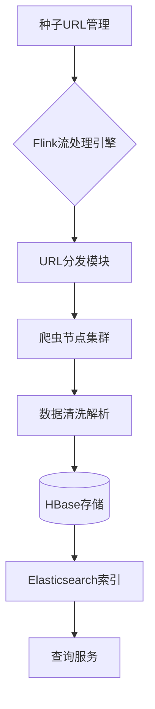

---
# 分布式智能爬虫系统

[](https://flink.apache.org)
[](https://hbase.apache.org)
[](LICENSE)

基于Flink和HBase构建的分布式网络爬虫系统，实现高效合规的网页数据采集、存储与检索。支持动态扩展节点、智能反爬策略及多维度监控。

## 目录
- [核心特性](#核心特性)
- [系统架构](#系统架构)
- [功能模块](#功能模块)
- [快速部署](#快速部署)
- [使用指南](#使用指南)
- [开发接口](#开发接口)
- [监控体系](#监控体系)
- [贡献指南](#贡献指南)
- [许可协议](#许可协议)

## 核心特性
- **分布式架构**：基于Flink流式计算框架实现动态任务调度
- **智能路由**：支持Hash轮询与动态负载均衡两种URL分发策略
- **合规采集**：内置robots.txt解析器与请求间隔随机化机制
- **弹性存储**：HBase列式存储结合Elasticsearch全文检索
- **容错机制**：异常URL自动重试与断点续爬能力

## 系统架构


## 功能模块
### 1. 种子URL管理
- 支持CSV/JSON格式批量导入
- Redis布隆过滤器去重

### 2. URL分发策略
1. **哈希分发**：基于域名Hash值分配爬虫节点
2. **动态负载**：根据节点负载情况实时调整

### 3. 数据存储体系
```sql
-- HBase表结构示例
CREATE 'webpage_data', 
  {NAME => 'meta', VERSIONS => 3},
  {NAME => 'content', COMPRESSION => 'SNAPPY'}
```

### 4. 查询服务
支持通过REST API进行多条件检索：
```bash
GET /search?q=keyword&domain=example.com
```

## 快速部署
### 环境要求
- JDK 11+
- Flink 1.20.0
- HBase 2.6.1

### 配置步骤
```bash
# 1. 安装依赖
mvn clean install -DskipTests

# 2. 启动HBase集群（伪分布式模式）
hbase/bin/start-hbase.sh

# 3. 提交Flink作业
flink run -c com.spider.Main target/spider-core.jar
```

## 监控体系
集成Prometheus+Grafana实现多维监控：
- **节点健康度**：CPU/内存使用率
- **采集效率**：URL处理速率（条/秒）
- **存储性能**：HBase Region负载均衡状态

## 贡献指南
欢迎通过Issue提交改进建议，代码提交前请执行：
```bash
mvn checkstyle:check
```

## 许可协议
本项目遵循 [Apache-2.0](LICENSE) 开源协议，使用请遵守《网络安全法》及相关法律法规。

---
该模板整合了系统设计文档、Flink-HBase集成实践和README规范，建议补充以下内容：
1. 在`data/`目录添加示例配置文件
2. 编写CONTRIBUTING.md详细说明开发规范
3. 增加Docker Compose部署方案

完整实现代码可参考分布式爬虫框架设计，具体HBase连接配置详见。
